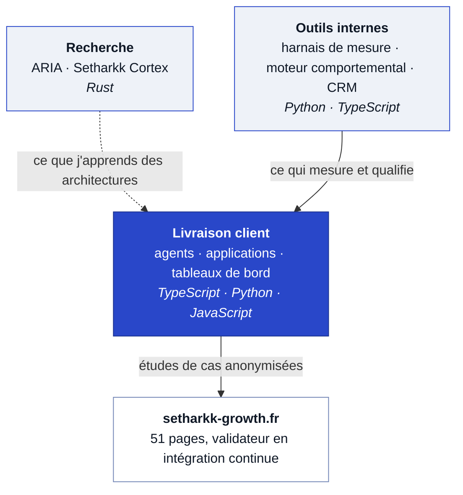

# Setharkk Growth

### *Audit de processus et IA, pour ceux qui n'ont pas de service informatique*

---

**Une vitrine, pas un dépôt de code.** 
Dix-sept dépôts, deux publics. Les autres appartiennent à mes clients ou ne sont pas prêts à être lus. 
Ce qui suit décrit le problème traité, l'architecture retenue, et les décisions qui ont coûté cher.

**[setharkk-growth.fr](https://setharkk-growth.fr)** · Martigues, PACA et toute la France

---

## L'écosystème en un schéma

---

## Recherche

Deux paris longs sur des architectures qui ne reposent ni sur l'attention ni sur des poids pré-entraînés. Ce sont des travaux de recherche, présentés comme tels : l'échec est une issue admise.

### ARIA · Rust

> *Geometric Intelligence, a new paradigm beyond transformers.*

Remplace le paradigme transformeur par des **Geometric Function Units**, où la relation entre neurones est une fonction géométrique plutôt qu'une tête d'attention. Aucun bloc transformeur, aucun poids pré-entraîné, tout construit depuis zéro.

La question posée : la géométrie différentielle offre-t-elle une base plus expressive et mieux fondée théoriquement que l'attention&nbsp;?

### Setharkk Cortex · Rust

> *Un cortex causal déterministe.*

| | |
|---|---|
| **Représentation** | Concepts en index `u32` dans des arènes contiguës |
| **Parcours** | Automate à pile à registres suivant des prédicats booléens, jamais un `argmax` |
| **Apprentissage d'erreur** | Bit d'inhibition **gravé définitivement** : l'erreur devient une contrainte que le processeur rejette en un cycle |
| **Compression** | Macros réutilisables, puis schémas polymorphes |
| **Budget** | Tranche active du chemin de décision sous **2 Mio**, donc en cache CPU |
| **Preuve** | Convergence établie par la théorie des treillis |

Succède à une version TypeScript d'environ **39 000 lignes** qui fonctionnait, mais dont quatre pathologies structurelles ont été diagnostiquées dans le code avant réécriture.

La décision d'architecture la plus importante est négative : **ne jamais dépendre d'un modèle de langage** comme oracle ni comme moteur de secours.

---

## Outils internes

| Projet | Ce qu'il fait | Pile |
|---|---|---|
| **Harnais de vérité terrain** | Mesure ce qu'un agent de code fait réellement. Chaque tâche est déclarée **avant** la session, critère figé par empreinte ; tout est tracé ; le verdict est **externe, jamais écrit par l'agent**. Trois courbes en sortent : autonomie, interventions par heure, horizon. | Python · SQLite |
| **Moteur de marketing comportemental** | Graphe métier d'environ 310 nœuds sur onze domaines, agents de rédaction et de profilage. | Next.js 15 · FastAPI · Neo4j |
| **CRM de prospection ciblée** | Recherche d'entreprises via SIRENE, signaux BODACC, enrichissement, notation. | Flask · FastAPI · Next.js · N8N · PostgreSQL · Neo4j |
| **Playbook commercial** | Les règles sont des requêtes, pas un document. | Cypher · Neo4j |

Le harnais est le prolongement direct de ce que je vends : **on ne décide pas quoi automatiser sans mesurer d'abord.** Chaque message envoyé en cours d'exécution y compte comme une intervention, reprise de session comprise. C'est volontairement sévère, une mesure indulgente ne servirait à rien.

---

## Travail client

Décrit sans nommer personne. Un client n'apparaît sous son nom que s'il l'a autorisé.

| Projet | Ce qu'il fait | Pile |
|---|---|---|
| **[Agent expert HubSpot](https://setharkk-growth.fr/realisations/agent-hubspot)** | Enrichissement, notation et audit sur une base réelle. Lecture libre, écriture validée, et les outils qui modifient tournent **en simulation par défaut**. | JavaScript · API HubSpot |
| **Agent de saisie, plateforme de formation** | Onze outils de lecture, vingt outils d'écriture idempotents, normalisation par liste blanche, vérification par relecture, validation humaine avant toute écriture, moteur plafonné à quarante étapes. OPCO résolu par SIRET via France compétences. | JavaScript · GraphQL |
| **SaaS de facturation et gestion commerciale** | Devis, factures, suivi commercial. | Python 3.13 · FastAPI · React 18 · PostgreSQL 16 |
| **Application facturation, paie et dossiers** | Livrée en poste de travail. Binaires publics, source privée. | Electron · TypeScript |
| **Tableau de bord pour une accompagnatrice indépendante** | Prise en main des nouvelles clientes automatisée, sur une base Notion. | Next.js 16 · React 19 · API Notion · Claude |
| **Assistant socratique de bootcamp** | Accompagne sur dix sessions. **Il ne fait pas le travail à leur place et ne valide aucune stratégie** : c'est sa contrainte de conception. Escalades, récapitulatif automatique, limitation de débit, rétention RGPD. | TypeScript · Claude |

---

## Dépôts publics

| Dépôt | |
|---|---|
| **[Setharkk](https://github.com/Setharkk/Setharkk)** | Agent IA autonome tournant **100 % en local** sur un GPU grand public. Mémoire long terme, graphe de connaissances. Zéro API cloud, zéro clé, zéro donnée qui sort. `Python` `Qwen 3.5 9B` `Neo4j` `PostgreSQL` |
| **[facturation-paie-releases](https://github.com/Setharkk/facturation-paie-releases)** | Versions publiques et canal de mise à jour d'une application livrée à un client. Le modèle que j'applique au travail client : binaires publics, source privée. |

---

## Le site, puisqu'il est aussi un projet

**[setharkk-growth.fr](https://setharkk-growth.fr)** · cinquante et une pages, aucun framework.

Un validateur maison en Python vérifie à chaque poussée : liens internes morts, parsage des JSON-LD, correspondance **mot pour mot** entre les questions du `FAQPage` et le texte visible, unicité du H1, cohérence du sitemap, et une liste de tournures interdites. Il tourne en intégration continue et **bloque la fusion**.

L'assistant du site est documenté comme étude de cas testable en direct : **[realisations/assistant-setharkk](https://setharkk-growth.fr/realisations/assistant-setharkk)**.

---

## Ce que vous ne verrez pas ici

Aucun nom de client, aucune marque cliente, aucun chiffre d'affaires.

Les études de cas complètes, anonymisées, sont sur **[setharkk-growth.fr](https://setharkk-growth.fr)**.

Si vous voulez lire du code avant de travailler avec moi, demandez : j'ouvre un accès en lecture sur un dépôt privé, au cas par cas.

**contact@setharkk-growth.fr**

